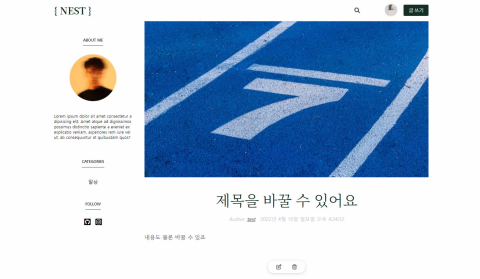

# { Curlybrackets }

## 배포링크 
- https://iwipwq-nest.herokuapp.com

## { Curlybrackets } 은 블로그 웹 앱 서비스입니다.
- 누구나 자유롭게 글을 열람 할 수 있습니다.
- 회원가입 후 로그인해서 출판이 가능합니다.
- 어떤 이야기든 괜찮습니다. 오늘 먹은 점심, 내가 좋아하는것, 그 밖의 자유로운 주제로 글을 쓰고 사진과 함께 출판 할 수 있습니다.

## 사용된 기술
- 프론트엔드 : React / React-Router v6 / Sass / axios
- 서버 API : Node.js / express.js / MongoDB / mongoose / multer

## 배포 및 버전관리
- heroku / github

## API 명세서

<details>
<summary> 펼쳐보기 </summary>

### 0.요청 URL
https://iwipwq-nest.herokuapp.com/api

### 1. 회원가입

API
```
POST /register
```
Req
```
{
    username: String,
    email: String,
    password: String,
} 
```
Res
```JSON
{   
    biography: String,
    createdAt: String,
    email: String,
    profileImg: String,
    updatedAt: String,
    username: String,
    __v: 0,
    _id: String,
}
```
### 2. 로그인

API
```
POST /login
```
Req
```JSON
{
    username: String,
    password: String,
} 
```
Res
```JSON
{
    biography: String,
    createdAt: String,
    email: String,
    profileImg: String, //(filename + Date.now())
    updatedAt: String,
    username: String,
    __v: Number,
    _id: String
}
```

### 3. 회원정보 (계정관리)

#### 3-1. 회원정보 가져오기
API
```
GET /user/:UserId
```
Res
```
{
    biography: String,
    createdAt: String,
    email: String,
    profileImg: String, //(filename + Date.now())
    updatedAt: String,
    username: String,
    __v: Number,
    _id: String
}
```

#### 3-2. 회원정보 수정
API
```
PUT /user/:userId
```
Req
```JSON
{        
    userId: String,
    username: String,
    email: String,
    password: String,
    biography: String,
    profileImg: String,
}

```
Res
```
{
    biography: String,
    createdAt: String,
    email: String,
    profileImg: String, //(filename + Date.now())
    updatedAt: String,
    username: String,
    __v: Number,
    _id: String
}

```
#### 3-2. 계정 삭제
API
```
DELETE /user/:userId
```
Req
```
{
    data: {
        userId: String,
        password: String,
    }
}
```
Res
```
{
    biography: String,
    createdAt: String,
    email: String,
    profileImg: String,
    updatedAt: String,
    username: String,
    __v: Number,
    _id: String
}
```

### 4. 포스트 정보 가져오기

#### 4-1. 특정 포스트 가져오기
API
```
GET /post/:postId
```

Res
```JSON
{   
    categories: [Array],
    createdAt: String,
    desc: String,
    title: String,
    updatedAt: String,
    username: String,
    __v: Number,
    _id: String
},
```

#### 4-2. 특정 유저의 포스트 가져오기
API
```
GET /post/:userId
```
Res
```JSON
{
        {   //첫번째 포스트 (data[0])
        categories: [Array]
        createdAt: String
        desc: String
        title: String
        updatedAt: String
        username: String
        __v: 0
        _id: String
    },

    //...
    //...

    {   //마지막 포스트 (data[data.length - 1])
        categories: [Array]
        createdAt: String
        desc: String
        title: String
        updatedAt: String
        username: String
        __v: 0
        _id: String
    },
}
```

#### 4-3. 모든 포스트 정보 가져오기
API

```
GET /post
```

Res
```json
[
    {   //첫번째 포스트 (data[0])
        categories: [Array]
        createdAt: String
        desc: String
        title: String
        updatedAt: String
        username: String
        __v: 0
        _id: String
    },

    //...
    //...

    {   //마지막 포스트 (data[data.length - 1])
        categories: [Array]
        createdAt: String
        desc: String
        title: String
        updatedAt: String
        username: String
        __v: 0
        _id: String
    },
]
```

### 5. 카테고리

#### 5-1. 카테고리 가져오기
API
```
GET /category
```
res
```JSON
{
    name: String,
    updatedAt: String,
}
```

#### 5-1. 카테고리 추가하기
API
```
GET /category
```
req
```JSON
{
    name: String,
}
```
res
```JSON
{
    name: String,
    updatedAt: String,
}
```
</details>

## 주요기능

### 메인페이지
- (사진추가)
- Curlybrackets (이하 {})의 메인페이지 입니다.
- 헤더부분에 오늘의 추천 포스트가 모든 포스트중에 무작위로 선발되어 게시됩니다.
- 모든 피드를 열람 할 수 있으며, 포스트 제목을 클릭하면 해당 포스트의 상세페이지로 이동할 수 있습니다.
- 메인페이지의 포스트목록들은 사진과 제목 그리고 3줄로 단축된 내용으로 표기됩니다.
- 탑 네비게이션에서 로그인 또는 회원가입을 할 수 있습니다.
- 로그인 시 좌측에 프로필바가 생기며, 회원정보를 확인 할 수 있습니다.

### 탑 네비게이션
- (로그아웃 시 탑 네비게이션 사진)
- `로고`, `검색(구현예정)`, `로그인`, `회원가입` 으로 이루어져있습니다.
- (로그인 시 탑 네비게이션 사진) 
- 로그인 시 `로그인`,`회원가입` 부분이 `프로필사진`과 `글쓰기` 버튼으로 교체됩니다.
- `프로필사진`에 마우스를 올리면, `내 블로그`, `내정보`, `로그아웃` 메뉴를 선택 할 수 있습니다.
- `로고` 클릭시 모든 피드를 볼 수 있는 메인페이지로 이동합니다.

### 회원가입
- (회원가입 사진)
- 필수정보인 이름, 이메일, 비밀번호를 폼에 명시된 조건으로 입력하고 회원가입 버튼을 누르면 가입이 완료됩니다.
- 이미 회원가입이 되어있다면 회원가입 버튼 하단의 `로그인` 텍스트 링크를 통해 로그인페이지로 이동 할 수 있습니다. 
- 입력된 양식값이 올바르지 않을 경우 어떤 조건이 필요한지 붉은색 글씨로 경고문이 나타납니다.
- 입력된 양식값이 유효할 경우 초록색 유효문이 나타납니다.
- 모든 양식이 유효하면 회원가입 버튼을 누를시 회원가입을 진행합니다.
- 서버로 아이디와 이메일 정보를 보내고 아이디 중복체크와 이메일 중복체크를 실시합니다.
- (중복 경고문 사진)
- 아이디와 이메일 중복될 경우 붉은색의 중복 경고문이 출력됩니다.
- (아이디 중복 값 다시 입력시 중복경고문 gif)
- 중복된 아이디값과 이메일 값을 기억하여 같은 값을 입력할 경우 다시 중복 경고문을 출력하여 사용자의 실수를 방지합니다.
- 비밀번호는 bcrypt로 암호화되어 보내집니다.
- 회원가입이 성공적으로 완료되면, 로그인페이지로 리다이렉트됩니다.

### 내 정보
#### 내 정보 수정하기
- (내 정보 페이지 사진)
- `이름`,`이메일`,`비밀번호` 등 사용자 정보를 수정하고, `프로필사진`과 `자기소개`를 업데이트 할 수 있는 페이지입니다.
- 프로필 사진 버튼(버튼이미지)를 눌러 원하는 프로필사진을 업로드 할 수 있습니다.
- (유효성 검사 gif)
- 이름과 이메일 비밀번호 등 필수 정보를 입력시, 입력시마다 유효성 검사를 실시합니다.
- 유효하지 않은 양식값이 들어올 경우 빨간색 경고문이 출력됩니다.
- 유효한 양식값일 경우 초록색 유효문이 출력됩니다.
- 모든 정보가 유효할 시 `수정하기` 버튼이 활성화 됩니다.

#### 회원 탈퇴
- (회원탈퇴 사진)
- DangerZone 섹션으로 따로 분류해두었습니다.
- 사용자가 주의문을 확인하고, 체크박스를 클릭하면 회원탈퇴 절차를 시작합니다.
- 체크박스가 체크되면 본인인증을 위한 비밀번호 확인란이 나타납니다.
- 비밀번호를 입력하고, 회원탈퇴 버튼을 누르면 서버로 현재 계정의 이름값으로 유저id를 판단하여 현재 사용자와 요청을 보내는 사용자가 같은지 확인합니다.
- 요청한 사용자가 현재사용자가 같다면, 암호화 된 비밀번호를 DB에 있는 비밀번호와 대조하여 같다면 회원정보와 회원이 작성한 모든 포스트를 삭제합니다.
- 삭제작업이 끝나면 정상적으로 삭제되었다는 알림창과 함께 메인페이지로 이동합니다.

### 글쓰기 페이지
- (글쓰기 페이지 사진)
- 사진과 함께 글을 써서 출판 할 수 있습니다.
- `파일아이콘버튼`을 클릭하면 원하는 사진을 업로드 할 수 있습니다.
- 파일 업로드는 필수가 아닙니다.
- 파일은 서버의 images 디렉토리에 저장됩니다.
- 제목란에 출판하고자 하는 `포스트 제목`을 적을 수 있습니다.
- 그 아래 `당신의 이야기를 들려주세요` 텍스트 필드에 하고싶은 이야기를 적을 수 있습니다.
- 모든 입력이 끝나고 `출판하기` 버튼을 누르면, 포스트가 등록되고, 해당 포스트 상세페이지로 이동합니다.

### 포스트 상세페이지
- (포스트상세페이지 사진)
- 해당 포스트의 상세 내용을 볼 수 있는 페이지입니다.
- `서버주소/post/포스트아이디값`을 주소로 접근 할 수 있습니다.
- 포스트 작성자가 업로드한 사진을 볼 수 있습니다.
- 포스트 제목, 상세내용과 업로드된 시간을 확인 할 수 있습니다.
- (플로팅 메뉴바 사진)
- 만약 해당 글의 작성자라면, 하단의 `플로팅메뉴바`에서 메모지모양의 `수정버튼`과 휴지통모양의 `삭제버튼`으로 글의 `수정`과 `삭제`를 페이지 내에서 진행 할 수 있습니다.
-(글을 수정하고 삭제하는 gif)

